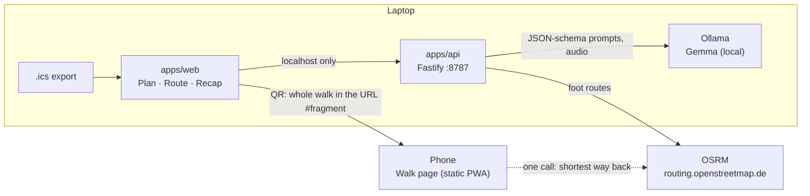

# Could've Been a Walk

> This meeting could have been a walk. So I built an AI that turns it into one.

[](https://github.com/kengnidoriane/could-have-been-a-walk/actions/workflows/ci.yml)

Drop your calendar export into the app. A **Gemma model running on your own computer** reads your
upcoming meetings and tells you which ones could be a walk. Pick one, and the app draws a walking
loop that starts and ends at your office and lasts **exactly as long as the meeting**, with the
agenda pinned along the way. Then your phone keeps you honest: when it's time to head back, it
says **TURN BACK NOW**, so you're at your desk when the meeting ends.

Built in Monrovia, Liberia, for the DEV Hacktoberfest Open-Source AI Challenge, Week 1: _Touch Grass_.

**Try it**

- 📱 **On your phone, nothing to install:** open the
  [demo walk](https://kengnidoriane.github.io/could-have-been-a-walk/#/walk?d=TZDdbtpAEIVfZTRXjbSKcCDQ-oYfB6UpbSIapb1AKAzewd5i7zq7YwxqE-UdetXXy5NEkFL18mjOmW_O_MQNxpFCwRinHVjWOmMBzakJxllojOQwcSuDCgPGUe9D9D5qd1sthXyU3fZerjHunJ4rrDBGqhwPfmWPi2F-JaOH4VPyMNyOb0Y0uh_sPspV-i27XA3X43BzP_ZJPdGfFomMy-niYjswyY9JcacvUSFhPJvhtA2hYqshCEkdoK40CfdR4fec5OX5TwDJGdLae7ZydLkVHIPGZn1ULdU7byn8SlZTUcCteGbBuZph4sqytkZ2UHmXeSphE06hoEpcFd44Js3B2A0HKfeMl-ffkP5LOX80HwYmwJKD9PEAPOt1Ogo_72ya_8-85u3-VK4CkNXgGss-_K0ElIpxNoBl1iAOlgxCa7ZgXdPHt5XtqNtTuKR0DSSHBwQhLzifKywwxgvXWHGNhS_OercxBO80l-4EH18B)
  (a real 3.2 km loop in downtown Monrovia) and tap **Demo: replay a walk at 10×**.
- 💻 **The whole thing, on your computer:** see [Quick start](#quick-start). It takes four commands.

## Screenshots

| Plan                                     | Route & agenda                       | TURN BACK NOW                      | Recap                               |
| ---------------------------------------- | ------------------------------------ | ---------------------------------- | ----------------------------------- |
| _(screenshot: meetings scored by Gemma)_ | _(screenshot: loop + numbered pins)_ | _(screenshot: the phone takeover)_ | _(screenshot: decisions & actions)_ |

## How it works

1. **Plan (laptop).** Drop a `.ics` export from Google Calendar, Outlook or Apple Calendar. It's
   parsed in the browser (time zones, recurring meetings, cancellations). No account, no OAuth.
2. **Score.** For each meeting, Gemma answers three things: what kind of meeting it is (1:1,
   decision, review, presentation…), whether people need to look at a screen, and a one-line
   reason. A visible formula turns that, plus headcount and length, into a 0–10 walkability score.
   _Gemma reads, code weighs:_ asked for the number directly, a small model scored a two-person
   budget decision 3/10 while its own reason argued for a walk.
3. **Route.** The local API asks OpenStreetMap's routing (OSRM, foot profile) for a loop that
   starts and ends at your office and fits the meeting minus a 3-minute buffer. In downtown
   Monrovia that's within ±5% (+0.2%, +4.7%, +4.6% on three tries), with no street walked twice.
   Waypoints that land in the Atlantic or the Mesurado River are detected and avoided.
4. **Agenda on the map.** Gemma splits the agenda into 2–4 topics with an opening question each
   and says how much time each deserves. Code lays them along the loop's named streets:
   "0–10 min, until Randall Street: Q3 spend · 10–36 min, until Lynch Street: the decision ·
   way back: next steps and owners".
5. **Invite.** Export a new `.ics` with the start point, the route link and the agenda by segment.
6. **Walk (phone).** Scan the QR code. The whole walk (route, end time, agenda) is _inside_ the
   link, about 500 characters, so the phone needs no server and no model. Live GPS and your real
   pace say when to **turn back now**: not at the first sign of delay, but at the last responsible
   moment, while the shortest way back still gets you there on time. Real walks are recorded on
   the phone and can be replayed at 10×.
7. **Recap (back at the desk).** With everyone's consent, record a minute of "so, what did we
   decide?". Gemma, on your computer, writes the decisions and the action items with owners.

Also: a rain warning (Monrovia gets around 5 metres of rain a year) with a shorter-loop option,
a weekly "N walks, X km, Y min away from the chair", and an installable walk page built to keep
going offline.

## Quick start

You need Node 20.19+, pnpm 10 and [Ollama](https://ollama.com).

```bash
git clone https://github.com/kengnidoriane/could-have-been-a-walk.git && cd could-have-been-a-walk
pnpm install
ollama pull gemma4:e2b
pnpm dev
```

Open http://localhost:5173 and click **Try a sample week** (fake meetings), or drop your own `.ics`.
No Gemma model yet? The app still works with its fallback rules and says so in the header.

**On a phone:** GPS only works on HTTPS pages. Either use the deployed walk page (set
`VITE_PUBLIC_WALK_URL`, see below), or run `pnpm dev:phone` and open the app through the network
address Vite prints (accept the self-signed certificate).

**Which model?** On a laptop without a GPU, `gemma4:e2b` is the comfortable choice. With a GPU, or
some patience, try `gemma4:e4b`. The API uses the first one it finds among `OLLAMA_MODEL`,
`gemma4:e2b`, `gemma4:e4b` and `gemma3:4b`. Voice recaps need Gemma 4 E2B/E4B (they can hear);
typed notes work with any model.

## Configuration

Copy `.env.example` to `.env`.

| Variable               | Default                                        | What it does                                          |
| ---------------------- | ---------------------------------------------- | ----------------------------------------------------- |
| `OLLAMA_MODEL`         | `gemma4:e2b`                                   | Gemma model used by the local API (via Ollama)        |
| `OLLAMA_HOST`          | `http://127.0.0.1:11434`                       | Where Ollama listens                                  |
| `OSRM_BASE_URL`        | `https://routing.openstreetmap.de/routed-foot` | Any OSRM-compatible server with a foot profile        |
| `API_PORT`             | `8787`                                         | Local API port                                        |
| `VITE_PUBLIC_WALK_URL` | _(empty)_                                      | HTTPS URL of the deployed walk page, used in QR codes |
| `VITE_OSRM_BASE_URL`   | FOSSGIS foot server                            | Where the phone asks for the shortest way back        |
| `VITE_TILE_URL`        | OpenStreetMap tiles                            | Map tiles (use a tile provider for anything heavier)  |

## Architecture



- `packages/core`: pure TypeScript, unit-tested. Calendar parsing and invites, geo, loop search,
  the turn-back engine, agenda layout, walk links, recap fallback, weather and stats.
- `apps/api`: local Fastify server. One Ollama wrapper (JSON schema from zod as `format`, zod
  validation, one retry, deterministic fallback) and a polite OSRM client (cache, 1 request/second).
- `apps/web`: Vite + React. The phone page is code-split and static (GitHub Pages).

More in [docs/ARCHITECTURE.md](./docs/ARCHITECTURE.md) and the decision log in [DECISIONS.md](./DECISIONS.md).

## Privacy

- Your calendar is parsed in your browser and read by a model **on your computer**. It is never
  uploaded. The local API listens on `127.0.0.1` only.
- Voice recaps need everyone's consent (the API refuses without it). The audio goes to Gemma on
  your computer and is never written to disk.
- The walk travels in the link's `#fragment`, which browsers never send to a server: even the
  static host of the walk page never sees your route.
- The only network calls are map tiles (OpenStreetMap), walking routes (OSRM) and the rain
  forecast (Open-Meteo, with the start point rounded to ~1 km).
- No analytics, no accounts, no cookies.

## Why open innovation matters

- **It runs on what people have.** A 2018 laptop, no GPU, no API key, no bill. Gemma on Ollama
  (Gemma 4 E2B) scores a meeting in about 10 seconds on that CPU, and nothing can be switched off
  from elsewhere.
- **Private by default, not by policy.** Calendars are some of the most sensitive data at work.
  With open weights the model comes to the data, instead of the data going to a model.
- **It works when the internet doesn't.** Connectivity in Monrovia comes and goes. The model is
  local, and the phone page needs no server.
- **Built on maps made by people.** The loops follow streets that volunteers put on OpenStreetMap
  (much of Monrovia was mapped during the 2014 Ebola response), routed by open-source OSRM on a
  server run by volunteers.
- **Swappable all the way down.** Another model (`OLLAMA_MODEL`), another routing server
  (`OSRM_BASE_URL`), other tiles (`VITE_TILE_URL`): no part of this is locked to a vendor.

## Development

```bash
pnpm check          # lint, format, typecheck, tests (core + api)
pnpm --filter @cbaw/api try-loop 6.3106 -10.8047 30 3   # live loop search against OSRM
pnpm --filter @cbaw/api try-score                      # live Gemma scoring on the sample week
```

The turn-back engine is tested with simulated walks: on pace, slow, fast, noisy GPS with junk
fixes, a long chat at the far end, a late start.

## Credits

This project stands on open-source shoulders:

- **[Gemma](https://ai.google.dev/gemma)** by Google DeepMind: the open-weight model behind scores, agendas and recaps.
- **[Ollama](https://ollama.com)** (MIT): runs Gemma locally.
- **[OpenStreetMap](https://www.openstreetmap.org/copyright)** contributors: map data © OpenStreetMap contributors, ODbL.
- **[OSRM](https://project-osrm.org)** (BSD-2-Clause) and the **[FOSSGIS](https://fossgis.de) routing server** at `routing.openstreetmap.de`: walking routes.
- **[ical.js](https://github.com/kewisch/ical.js)** (MPL-2.0): calendar parsing.
- **[Open-Meteo](https://open-meteo.com)** (data CC BY 4.0): the rain forecast.
- **[Leaflet](https://leafletjs.com)** (BSD-2-Clause): the maps.
- **[node-qrcode](https://github.com/soldair/node-qrcode)** (MIT): the QR handoff.
- **[Fraunces](https://fonts.google.com/specimen/Fraunces)** (SIL OFL 1.1, via Fontsource): the display font.
- **[Fastify](https://fastify.dev)** (MIT), **[React](https://react.dev)** (MIT), **[Vite](https://vite.dev)** (MIT), **[Zod](https://zod.dev)** (MIT), **[Vitest](https://vitest.dev)** (MIT).

## License

[MIT](./LICENSE) © 2026 Doriane Fosso

## Post-deadline commits

_None yet._ (Deadline: October 11, 2026, 23:59 PDT.)
