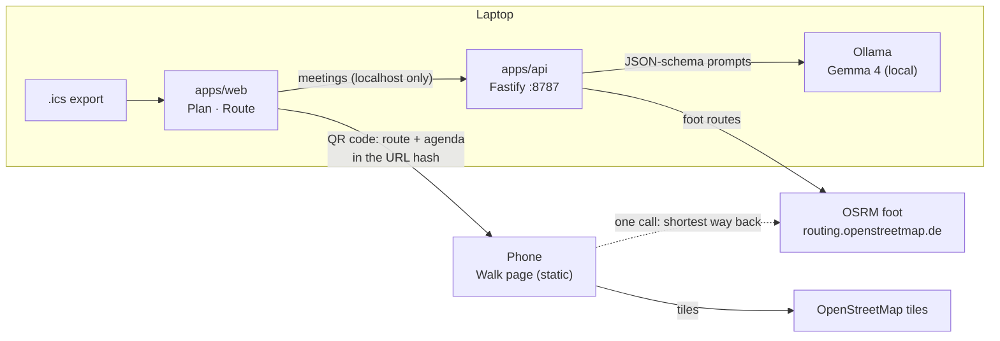

# Architecture

## Packages

| Package         | Role                                                                                                |
| --------------- | --------------------------------------------------------------------------------------------------- |
| `packages/core` | Pure TypeScript, unit-tested: `.ics` parsing and generation, geo math, loop search, turn-back logic |
| `apps/api`      | Local Fastify server. Wraps Ollama (structured JSON + zod) and the routing provider                 |
| `apps/web`      | Vite + React PWA. Plan and Route pages on the laptop, Walk page on the phone                        |

## Data flow

_Filled in as milestones land._
