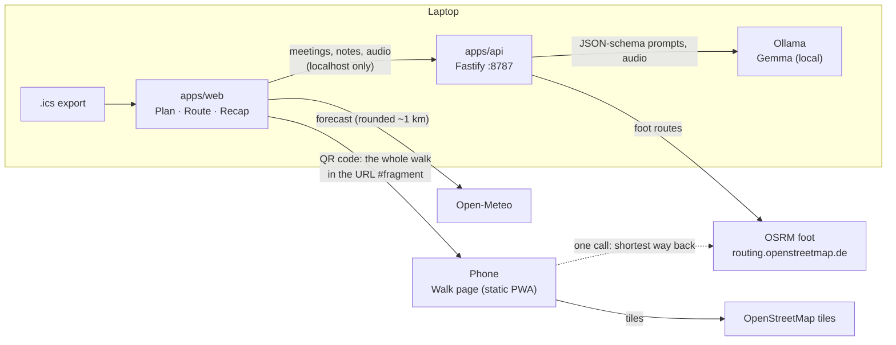

# Architecture

## Packages

| Package         | Role                                                                                       |
| --------------- | ------------------------------------------------------------------------------------------ |
| `packages/core` | Pure TypeScript, unit-tested, used by both apps: no network, no storage.                   |
| `apps/api`      | Local Fastify server on `127.0.0.1`. Wraps Ollama and the routing provider.                |
| `apps/web`      | Vite + React. Plan, Route and Recap on the laptop; Walk on the phone (code-split, static). |

### `packages/core`

| Module           | What it does                                                                                                                   |
| ---------------- | ------------------------------------------------------------------------------------------------------------------------------ |
| `ics.ts`         | Parse VEVENTs with ical.js (time zones, recurrences, EXDATE, moved occurrences); write the walking invite.                     |
| `geo.ts`         | Haversine, routes with cumulative distances, windowed projection onto a route, Douglas–Peucker.                                |
| `polyline.ts`    | Encoded polyline format (precision 5).                                                                                         |
| `loop.ts`        | Loop search: square inscribed in a circle through the start, bounded radius search, spur trimming, water detection, landmarks. |
| `walkability.ts` | Meeting kinds, `scoreFromSignals` (the one scoring formula) and the keyword fallback.                                          |
| `agenda.ts`      | Checkpoints from landmarks (or time marks), weighted topics laid out along the loop, description fallback.                     |
| `walkPlan.ts`    | Pack a whole walk into a URL-safe string (compact JSON → deflate-raw → base64url) and back.                                    |
| `turnBack.ts`    | The turn-back engine: progress, moving pace, ETAs, debounced decisions.                                                        |
| `simulate.ts`    | `VirtualWalker` for tests and the demo replay; seeded noise.                                                                   |
| `recap.ts`       | Keyword recap fallback and plain-text export.                                                                                  |
| `weather.ts`     | Rain risk for the meeting's hours from an Open-Meteo hourly forecast.                                                          |
| `stats.ts`       | Weekly walk stats.                                                                                                             |

### `apps/api`

| Route              | Does                                                                                              |
| ------------------ | ------------------------------------------------------------------------------------------------- |
| `GET /api/health`  | Which Gemma model answers (first pulled of `OLLAMA_MODEL`, gemma4:e2b, gemma4:e4b, gemma3:4b).    |
| `POST /api/loop`   | `findLoop` with the OSRM router: 400 invalid, 422 no loop, 502 routing down.                      |
| `POST /api/score`  | One Gemma call per meeting → `{kind, needsScreen, reason}` → `scoreFromSignals`. Fallback: rules. |
| `POST /api/agenda` | Gemma → topics with weights → `normalizeAgenda` on the loop's checkpoints. Fallback: description. |
| `POST /api/recap`  | Consent required. Audio → Gemma transcription (E2B/E4B) → Gemma recap → grounded actions.         |

`llm/ollama.ts` is the only door to the model: the zod schema becomes Ollama's `format` (JSON
schema, so decoding is constrained), the answer is validated with zod, one retry feeds the error
back, then the caller falls back to deterministic code. Timeouts are per request: a long answer at
~4 tokens/s on a laptop CPU takes 40–50 s.

`routing/osrm.ts` is polite to the volunteer server: descriptive User-Agent, one request per 1.1 s,
coordinates rounded to ~1 m, memory + disk cache, snapping distances kept to detect water.

## Data flow of one walk

1. **Plan:** the browser parses the `.ics` (`parseIcs`), keeps meetings in `sessionStorage`, and
   queues them for `/api/score` one at a time (the list fills in progressively; scoring pauses
   while a meeting is being planned, because Ollama answers one request at a time).
2. **Route:** `/api/loop` with the start point (from `localStorage`), pace and a seed. The browser
   also asks Open-Meteo for the meeting's hours, and offers a shorter loop if rain is likely.
3. **Agenda:** `/api/agenda` with the meeting and the loop's landmarks; segments come back with
   distances along the loop and are drawn as numbered pins.
4. **Hand-off:** `encodeWalkPlan` packs route + times + agenda into ~500 characters; that goes in
   the QR code and in the `.ics` invite, as `…/#/walk?d=…`.
5. **Walk:** the phone decodes the plan, watches GPS (or replays a scripted walk at 10×), and calls
   `assess()` every second. When the loop no longer fits, it asks OSRM once for the shortest way
   back; TURN BACK NOW fires when that way back is about to stop fitting.
6. **Recap:** back on the laptop, consent → voice memo (16 kHz WAV, ≤ 30 s pieces) or notes →
   `/api/recap` → decisions and action items.

## The turn-back engine in one paragraph

Progress is the GPS fix projected onto the loop, searched only near the previous position (on a
loop, the start and the finish are the same place). Pace is the least-squares slope of progress
over the last two minutes of _moving_ time (stops are cut out: the clock already counts them),
trusted gradually and smoothed. ETA by the loop and ETA by the shortest way back are compared with
the meeting end minus a 2-minute margin. If the loop fits: on track (or "detour?" when well ahead).
If it doesn't: keep walking while the way back still leaves more than a minute of slack, then
TURN BACK NOW. Decisions must hold 15 s before they show; turning back is sticky until arrival.
